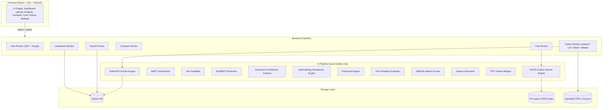

# 📄 PaperPilot AI

### AI-Powered Research Paper Summarizer and Academic Assistant

PaperPilot AI helps students, researchers, and professors understand research papers fast. Upload a PDF and get executive/standard/detailed summaries, a simplified explanation, key contributions, research gaps, future scope, a full methodology breakdown, keywords, flashcards, viva questions, a ready-made PPT outline, citations in 4 formats, a difficulty score, a RAG-based chat interface, and multi-paper comparison — all exportable to PDF, DOCX, PPTX, Markdown, or TXT.

Every AI feature runs **100% locally** on free, open-source models. No OpenAI/Gemini/Claude/Azure API key is required, and no paid service is called at any point.

---

## Table of Contents
* [Features](#features)
* [Tech Stack](#tech-stack)
* [Architecture](#architecture)
* [Folder Structure](#folder-structure)
* [Installation](#installation)
* [Running with Docker](#running-with-docker)
* [Usage](#usage)
* [API Documentation](#api-documentation)
* [Troubleshooting](#troubleshooting)
* [Future Scope](#future-scope)
* [License](#license)

---

## Features

| Category | Details |
| :--- | :--- |
| **Auth** | Local username/password auth (JWT), no third-party identity provider |
| **Upload** | Drag-and-drop, multi-file, progress bar, size/type validation |
| **Parsing** | Title, authors, abstract, and section extraction (PyMuPDF + heading heuristics) |
| **Summaries** | Executive (~100w), Standard (~300w), Detailed (~700w) via local BART |
| **Simplified Explanation** | Beginner-friendly rewrite + auto-glossary of acronyms |
| **Key Contributions** | Embedding-similarity + cue-phrase extractive analysis |
| **Research Gaps / Scope** | Same extractive technique, different anchor sentences |
| **Methodology Breakdown** | Datasets, algorithms, metrics, and pipeline steps |
| **Keywords** | Top 20 keyphrases via KeyBERT |
| **Flashcards** | Auto-generated Q/A + cloze cards |
| **Viva Questions** | Easy / Medium / Hard / Professor-level, template-driven and paper-specific |
| **PPT Outline** | 15-slide outline, exportable as a real `.pptx` |
| **Citations** | APA, IEEE, MLA, Chicago |
| **Difficulty Score** | Readability + vocabulary + math density + technical term density |
| **Chat with PDF** | Local RAG: FAISS + sentence-transformers + extractive QA model |
| **Compare Papers** | 2–5 papers: shared objectives, algorithm/dataset/metric union, similarity matrix |
| **Export** | PDF, DOCX, Markdown, TXT, PPTX |
| **History** | Search, filter, delete, re-analyze |
| **Dashboard** | Stats, keyword trends, recent activity |
| **Settings** | Dark mode, summary length preference, account info |

---

## Tech Stack

* **Frontend:** React, Vite, Tailwind CSS, React Router, Axios, Framer Motion, Recharts, Lucide Icons
* **Backend:** FastAPI, Python 3.11, SQLAlchemy, SQLite
* **AI/NLP:** HuggingFace Transformers (`facebook/bart-large-cnn`), Sentence-Transformers (`all-MiniLM-L6-v2`), KeyBERT, spaCy, FAISS, extractive QA (`deepset/roberta-base-squad2`)
* **Export:** python-docx, python-pptx, ReportLab
* **Auth:** python-jose (JWT) + passlib (bcrypt), fully local

---

## Architecture


```
## Installation

### Prerequisites

- Python 3.11+
- Node.js 18+ and npm
- ~4 GB free disk space (for downloaded model weights, cached after first run)

### 1. Backend Setup

```bash
cd backend
python -m venv venv
source venv/bin/activate        # Windows: venv\Scripts\activate

pip install -r requirements.txt
python -m spacy download en_core_web_sm

cp .env.example .env            # edit SECRET_KEY etc. if needed

uvicorn app.main:app --reload --port 8000
```

The first request that touches the AI pipeline (uploading a paper) will
download the summarization/embedding/QA models from the Hugging Face Hub
(a few hundred MB total). This happens once — after that, everything runs
fully offline from the local cache.

Backend runs at: **http://localhost:8000** (Swagger docs at `/docs`)

### 2. Frontend Setup

```bash
cd frontend
npm install
npm run dev
```

Frontend runs at: **http://localhost:5173**

---

## Running with Docker

```bash
docker compose up --build
```

- Frontend: http://localhost:3000
- Backend: http://localhost:8000

> Note: the backend Docker image pre-downloads the spaCy model at build
> time; the Transformer/embedding models are still downloaded on first use
> and cached in the `backend/data` volume mount.

---

## Usage

1. Open the frontend, click **Get Started**, and register an account.
2. Go to **Upload**, drag in one or more PDF research papers.
3. Papers are analyzed in the background — poll status on the **History**
   page or open the paper directly to watch it complete.
4. Once analyzed, open a paper to see all tabs: Summaries, Simplified
   Explanation, Contributions, Gaps, Methodology, Keywords, Flashcards,
   Viva Questions, Citations, and PPT Outline.
5. Use **Export** on the paper page to download PDF / DOCX / PPTX / MD / TXT.
6. Open **Chat** on a paper to ask questions answered only from that paper.
7. Use **Compare** to select 2–5 analyzed papers and see a side-by-side
   comparison table plus shared objective terms.

---

## API Documentation

Interactive Swagger UI is auto-generated by FastAPI at:
**http://localhost:8000/docs**

Key endpoints:

| Method | Endpoint | Description |
|---|---|---|
| POST | `/api/auth/register` | Create an account |
| POST | `/api/auth/login` | Get a JWT access token |
| GET  | `/api/auth/me` | Current user info |
| PUT  | `/api/auth/settings` | Update preferences |
| POST | `/api/papers/upload` | Upload one or more PDFs (starts async analysis) |
| GET  | `/api/papers` | List papers (supports `?search=`) |
| GET  | `/api/papers/{id}` | Full analysis detail |
| DELETE | `/api/papers/{id}` | Delete a paper |
| POST | `/api/papers/{id}/reanalyze` | Re-run the analysis pipeline |
| GET  | `/api/papers/{id}/chat` | Chat history |
| POST | `/api/papers/{id}/chat` | Ask a question (RAG) |
| POST | `/api/compare` | Compare 2-5 papers |
| GET  | `/api/papers/{id}/export/{fmt}` | Export as `pdf｜docx｜pptx｜md｜txt` |
| GET  | `/api/dashboard` | Dashboard statistics |

All endpoints except `/api/auth/register` and `/api/auth/login` require
`Authorization: Bearer <token>`.

---

## Troubleshooting

**"No extractable text found in this PDF"**
The PDF is likely a scanned image without a text layer. PaperPilot AI does
not include OCR by default; add an OCR pre-processing step (e.g. Tesseract)
if you need to support scanned papers.

**First upload takes a long time**
The first analysis run downloads several hundred MB of model weights from
Hugging Face. Subsequent runs use the local cache and are much faster.

**`spacy.load` fails / "model not found"**
Run `python -m spacy download en_core_web_sm` inside your virtual
environment. The app falls back to a blank pipeline (with reduced NLP
quality) if this step is skipped, so it still runs — but results will be
better with the full model installed.

**Out of memory when loading models**
`facebook/bart-large-cnn` and the QA model both need noticeable RAM
(1.5–3 GB combined). On constrained machines, swap `SUMMARIZATION_MODEL` in
`.env` to a lighter model, e.g. `sshleifer/distilbart-cnn-12-6`.

**CORS errors in the browser console**
Make sure `FRONTEND_ORIGINS` in the backend `.env` includes the exact
origin your frontend is served from (e.g. `http://localhost:5173`).

**FAISS index seems stale after re-analyzing a paper**
Deleting a paper also deletes its FAISS index; re-analyzing does not
currently rebuild it automatically (the RAG index is built lazily on the
first chat question after re-analysis using the updated `raw_text`).

---

## Future Scope

- OCR support for scanned PDFs (Tesseract / EasyOCR)
- Background task queue (Celery + Redis) instead of FastAPI `BackgroundTasks`
  for better horizontal scaling
- Multi-user workspace / paper sharing
- Fine-tuned, domain-specific summarization models (CS vs. Biology vs. Physics)
- Browser extension to summarize a paper directly from arXiv/IEEE Xplore

---

## License

MIT License — free to use, modify, and distribute for academic and
commercial purposes. See `LICENSE` for full text.
